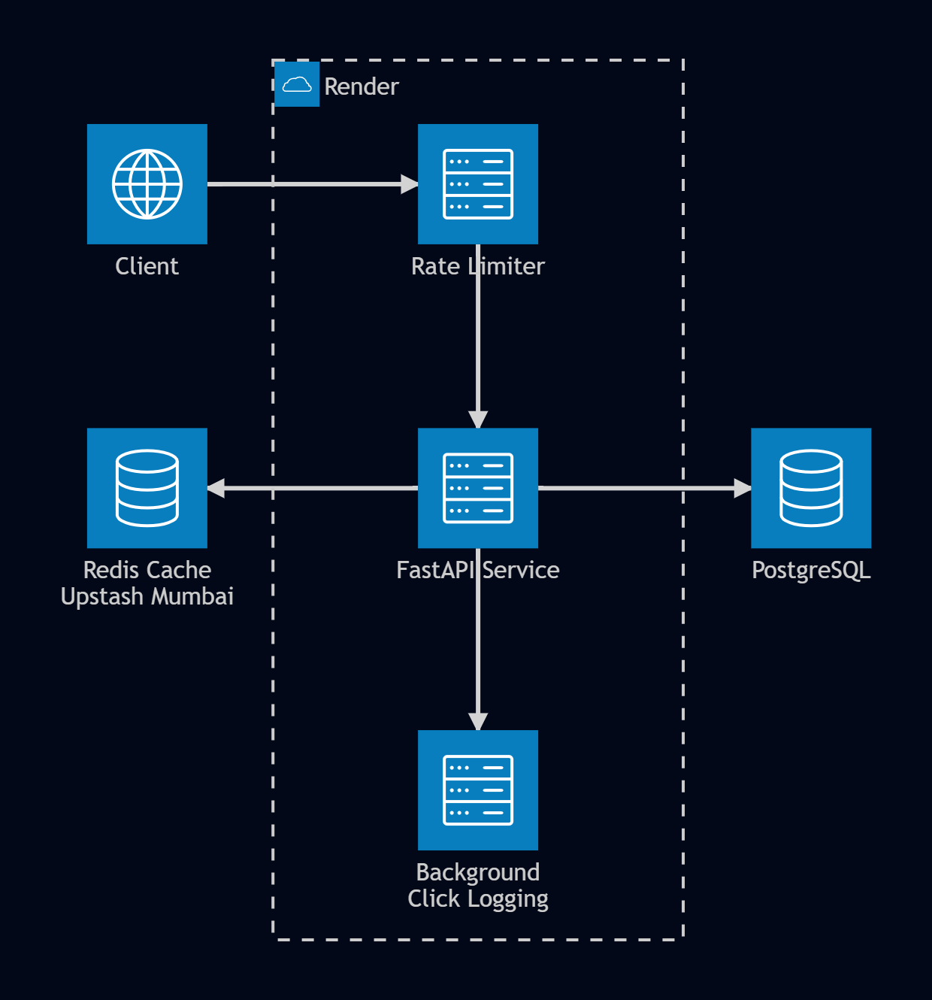

# URL Shortener & Analytics API

**Live demo:** https://url-shortener-672q.onrender.com/docs · **GitHub:** https://github.com/Shardul9999/url-shortener

A production-style REST API that shortens URLs, serves sub-millisecond cached redirects, and tracks click analytics. Built to demonstrate async Python backend patterns: Redis cache-aside, atomic sliding-window rate limiting, SSRF-hardened input validation, fire-and-forget background tasks, and a full pytest suite running on GitHub Actions CI. Deployed on Render (web service + PostgreSQL) with Upstash Redis.

---

## Architecture



**Request flow:**

- **Redirect (GET `/{code}`)** — Redis is checked first. On a cache hit the 302 is returned immediately and a background task records the click asynchronously (does not block the response). On a cache miss the URL is fetched from PostgreSQL, written to Redis with a TTL, then the redirect fires.
- **Shorten (POST `/shorten`)** — writes to PostgreSQL, rate-limited by a sliding-window counter stored in Redis.
- **Analytics (GET `/analytics/{code}`)** — reads from PostgreSQL: the denormalized `click_count` on the URL row plus the 10 most recent rows from the `clicks` table.

---

## Features

- Async FastAPI endpoints: shorten, redirect, analytics
- Redis cache-aside on redirects — URL lookups served from memory after the first request
- Sliding-window rate limiter using Redis atomic pipelines — applied independently to `POST /shorten` (100 req/min) and `GET /{code}` (1 000 req/min)
- SSRF-hardened URL validation — rejects private IPv4 ranges (10.x, 172.16–31.x, 192.168.x), IPv6 loopback (`::1`), `127.x` loopback, the AWS/GCP metadata endpoint (`169.254.169.254`), `localhost`, and non-HTTP(S) schemes (`javascript:`, `file://`, `data:`)
- Async click tracking via FastAPI `BackgroundTasks` — analytics writes happen after the redirect response is sent
- URL expiry — `expires_at` checked on every redirect; expired URLs return 404
- Configurable CORS via `ALLOWED_ORIGINS` environment variable (no wildcard in production)
- 22-test pytest suite, 94% coverage, all tests async with `pytest-asyncio`
- GitHub Actions CI — runs pytest + black formatting check on every push

---

## Performance

### Cache effectiveness (local benchmark)

Measured directly against Docker Compose (Postgres + Redis on localhost, no network latency):

| Path | Latency |
|---|---|
| Cache miss — Postgres round-trip | ~39.96 ms |
| Cache hit — served from Redis | ~6.68 ms |

**6× latency reduction** on repeat requests by eliminating the Postgres round-trip via Redis cache-aside.

### Load test (live production deployment)

Load tested with k6 against the live deployment (Render free tier, Oregon US-West + Upstash Redis, Mumbai ap-south-1):

| Scenario | P95 | P99 | Error rate | Throughput |
|---|---|---|---|---|
| 5 concurrent VUs, 30 s | ~916 ms | ~1.27 s | 0% | — |
| 100 concurrent VUs, 30 s | ~2.89 s | ~3.11 s | 0% | ~43 req/s |

> The gap between the local benchmark (6.68 ms) and production latency (900 ms+) is explained entirely by cross-region network round-trips between Render and Upstash — not application logic. The cache-aside pattern works as designed (see local benchmark above). Same-region deployment or a paid tier would substantially close this gap. This was a deliberate infrastructure tradeoff to keep the project on free-tier hosting.

Load test script: [`loadtest.js`](loadtest.js) (k6)

---

## Local Development

**Prerequisites:** Docker, Docker Compose, Python 3.11

```bash
git clone https://github.com/Shardul9999/url-shortener.git
cd url-shortener

# Configure environment
cp .env.example .env
# Edit .env — set DATABASE_URL, REDIS_URL, SECRET_KEY, BASE_URL

# Start Postgres + Redis
docker compose up -d db cache

# Create a virtual environment and install dependencies
python -m venv .venv
source .venv/bin/activate   # Windows: .\.venv\Scripts\Activate.ps1
pip install -r requirements.txt

# Run database migrations
alembic upgrade head

# Start the API
uvicorn app.main:app --reload
```

API is available at `http://localhost:8000`. Interactive docs at `http://localhost:8000/docs`.

### Running tests

Tests require a separate test database and run against local Postgres/Redis (not the Docker API container).

```bash
# Create the test database once
docker compose exec db psql -U postgres -c "CREATE DATABASE urlshortener_test;"

# Run the suite
pytest tests/ -v --cov=app --cov-report=term-missing
```

---

## API Reference

| Method | Path | Description |
|---|---|---|
| `POST` | `/shorten` | Create a short URL. Body: `{ "original_url": "...", "expires_in_hours": 24 }` |
| `GET` | `/{short_code}` | Redirect to the original URL (302) |
| `GET` | `/analytics/{short_code}` | Click count, recent clicks, expiry info |
| `GET` | `/health` | Health check |

Full schema available at `/docs` (Swagger UI) or `/redoc`.

---

## Environment Variables

| Variable | Default | Description |
|---|---|---|
| `DATABASE_URL` | — | PostgreSQL asyncpg connection string |
| `REDIS_URL` | — | Redis connection string |
| `SECRET_KEY` | — | Application secret (unused in current version, reserved) |
| `BASE_URL` | `http://localhost:8000` | Prefix used when building short URLs |
| `RATE_LIMIT_PER_MINUTE` | `100` | Max `POST /shorten` requests per IP per minute |
| `REDIRECT_RATE_LIMIT_PER_MINUTE` | `1000` | Max `GET /{code}` requests per IP per minute |
| `CACHE_TTL_SECONDS` | `3600` | Redis TTL for cached URLs |
| `ALLOWED_ORIGINS` | _(empty)_ | Comma-separated CORS origins; leave empty if no browser client |

See [`.env.example`](.env.example) for a complete template.
